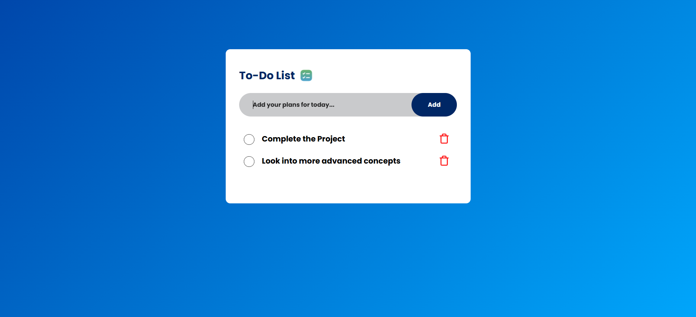
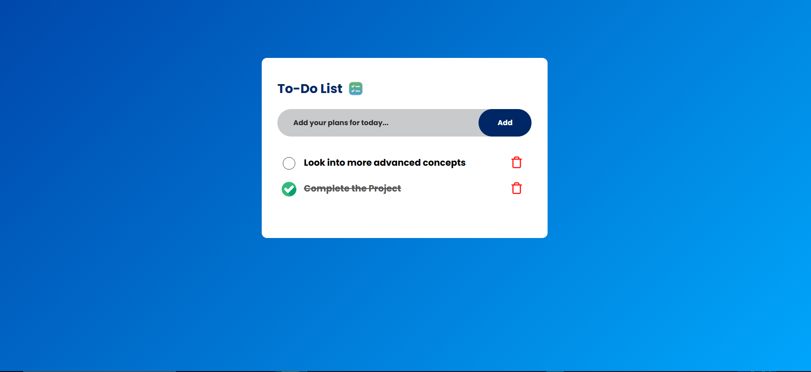

# 📝 To-Do List Web App  

A simple, interactive **To-Do List** built with **HTML, CSS, and JavaScript**.  
This app lets you **add, check and delete tasks**, with **local storage** support to save your progress.  

---

## 🚀 Features  

### ✅ **Task Management**  
- **Add Tasks** – Type a task and press "Add" to include it in the list.  
- **Delete Tasks** – Click the 🗑️ (trash icon) to remove a task.  
- **Mark as Completed** – Click a task to mark it as **done** (checked).  

### 🔄 **Automatic Reordering**  
- Completed tasks automatically **move to the bottom** of the list.  
- Unchecked tasks **stay at the top** for easy visibility.  

### 💾 **Persistent Storage**  
- **LocalStorage Support** – Your tasks **stay saved** even after you close the browser.  
- When you reopen the app, it loads all your tasks automatically.  

### 🎨 **User-Friendly UI**  
- Hover effect on the **delete icon** (magnifies on hover).  
- Checked tasks get a **visual style change** to indicate completion.  
- Minimalist and clean **CSS styling**.  

---

## 🛠️ How to Use  

1. **Enter a task** in the input box and press "Add".  
2. **Click a task** to mark it as completed (it moves to the bottom).  
3. **Click the trash icon** 🗑️ to delete a task.  
4. **Close and reopen the app** – Your tasks will still be there!  

---

## 🖥️ Technologies Used  

- **HTML** – Structure  
- **CSS** – Styling  
- **JavaScript** – Functionality  
- **LocalStorage** – Persistent data  

---

## 📷 Screenshot  

### 🖼️ Screenshot 1  
  

### 🖼️ Screenshot 2  
 
---

## 🏆 Credits

### 🎥 Reference Video:  
The following video was used as reference:  
🔗 **[YouTube Video](https://youtu.be/G0jO8kUrg-I?si=hLvePLARZG_8fQXy)**  
 
